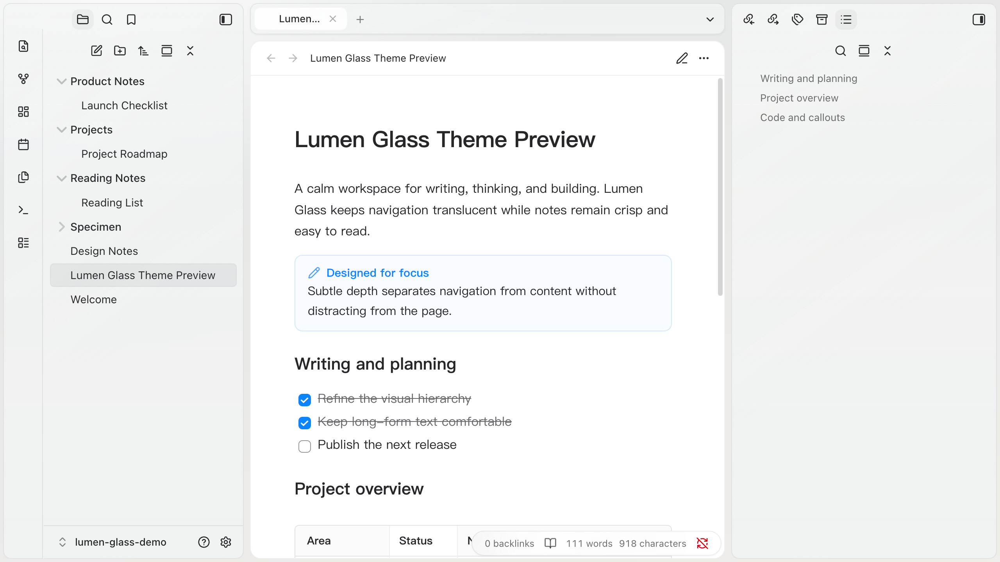

# Lumen Glass · Final Design Specification

Reference capture: [`assets/screenshot.png`](assets/screenshot.png)

The public preview must be captured from a real Obsidian window with the released theme enabled. Reconstructed browser mockups are not acceptable because they can misrepresent native window controls, pane proportions, typography, content density, and material behaviour.

**Approved for development.** The implementation should satisfy the workspace coverage targets below and remain visually consistent with the real application capture above.

## Coverage targets

| No. | Screen | Required elements |
|---|---|---|
| 01 | Light workspace | Mountain-toned environment, glass chrome, white paper content, and capsule treatments for the current file and tab |
| 02 | Dark command palette | Deep ink background with a low violet aurora and a centered horizontal glass card; concentric radii and corrected spacing |
| 03 | Settings | Glass shell, paper form surface, and a solid-blue primary button |
| 04 | Mobile | Paper centered in the viewport, a glass-island bottom bar, and 44px hit targets |

## Layering

1. Environment: wallpaper or gradient; provides colour only
2. Paper: editor, reading view, Settings content, code, and callouts
3. Glass: ribbon, sidebars, tabs, status capsule, command palette, and menus

## Dark appearance

Dark is the night version of light, not a separate brand. The surface order is the same: environment deepest, chrome above it, paper lightest. The ribbon, both sidebars, and the tab strip share one material so they read as one chrome. Paper (`#1e1d25`) carries a trace of the environment hue instead of a pure neutral grey. The violet is an aurora at the top-left of the wallpaper at half strength; it must not show through any panel strongly enough to give that panel its own colour.

## Selection

Use a lifted neutral capsule in both appearances: a faint fill with a hairline top highlight. Do not use an outline, a coloured rail, or an inset shadow; in dark mode the inset made the current row and tab read as holes, the dimmest items in their lists.

## Spacing and Radii

- Chrome: reserve an 8px frame at the window edge (`--lg-chrome-frame`) and an 8px seam between panels (`--lg-chrome-gap`, `--lg-space-2`). Two panels that share a seam each contribute half; the side that meets the window contributes the frame. The seam is an explicitly declared quantity, not the remainder of colliding margins. The 8px value is a structural seam, not floating desktop spacing: at 12px, the wallpaper channel was wider than the corner radius and the three columns read as separate objects floating on a desk. Reducing it to `--lg-space-2` keeps the 10px corners visible without collapsing into the default theme's flat 0px layout. On narrow windows (≤700px), only the outer frame contracts to 4px; the seam remains unchanged. `.lumen-chrome-flush` reduces both to zero.
- Cap the outer frame at 4px on frameless macOS windows. The system paints its traffic lights over our panels at a measured x 14..74 and y 12..25, and it will not move them for the theme. Once the frame exceeds that inset, the panel's top edge runs into controls it cannot avoid. This is a platform constraint, so the entire frame contracts together; trimming only the top edge creates a more obvious asymmetry.
- In the same area, the traffic lights extend through x 74, beyond the ribbon's inner edge. The ribbon divider therefore falls between the yellow and green controls and splits a three-button group that the OS draws as one unit. Do not draw the divider inside the control band—the top 32px—so the ribbon and sidebar read as one surface there. Resume the divider below 32px.
- Divide half-seams at the point of use (`calc(var(--lg-chrome-gap) / 2)`) instead of creating a derived token. Tokens declared in `:root` substitute derived values there and inherit the frozen result, so later changes to the gap no longer propagate. Flush mode exposed exactly this failure.
- Use hairline strokes: `1px`, white at 22% in light mode and 8% in dark mode. Dark hairlines inside the paper (Properties, tables, code) stay at or below 14%. Do not stack multiple inset strokes into a heavy frame.
- Let the status bar span the editor column and align its text to the right; it is not a small capsule floating in the bottom-right corner.
- Ribbon: 52px wide, stadium shape.
- Sidebars: 26px.
- Tab strip, status, and buttons: 999px.
- Paper, callouts, and code: 14px.
- Command-palette shell: 22px; rows and input: 10px.
- File tree and tabs: 10px. Never use 46px or 999px here.
- Reserve `999px` for the status bar, toggles, primary buttons, and the ribbon island.
- Default body measure: 40em, configurable through Style Settings.
- Sidebar tree rows: the highlight capsule starts 12px from the panel edge, the icon at 16px, the label at 36px, and the trailing count at 20px. All five panes use the same measurements, so rows do not shift horizontally when switching tabs.
- Properties rows: the icon height follows `--lg-control-size`, matching the key input height so the icon and label share one centreline.

The old draft used a 28px shell and 46px capsules for inner rows, which squeezed an odd arc out of the right side. This has been corrected.

The sidebar-row measurements require two implementation paths because Obsidian itself is inconsistent across views. A row hangs its leading icon 20px to the left of the text box so labels remain in the same column whether or not the row has a disclosure arrow. The Tags pane demonstrates that this offset is load-bearing: collapsible and ordinary rows at the same depth both place their labels at 36px. The depth therefore cannot change. What is missing is a gutter into which the icon can hang. Core normally reserves 24px in `--nav-item-padding`, but some views reduce it to 8px. The icon then hangs into the panel margin—measured at 4px from the edge in Properties and approximately 0 in link panes—outside the row's hover shape.

Tags, Backlinks, Outgoing Links, and Bookmarks only need that 24px restored. Properties and Outline cannot be fixed the same way because core writes `padding-inline-start: 12px !important` inline, beyond the stylesheet's ability to override. The icon itself is `position: absolute`, however, and its offset comes from its own margin. Reducing the hang from 20px to 8px reaches the same landing point from the other direction. Because the icon is out of flow, the label does not follow it; shortening the hang alone overlaps the first characters by a measured 8px. Move the label by the same additional 12px.

The in-document Properties block carries a similar debt, this time introduced by the theme. The key cell top-aligns its children so a wrapped value leaves the label on the first line. The icon's own height, rather than the row height, therefore determines its landing point. Obsidian sizes the icon for its native 28px field, while our form minimum expands fields to `--lg-control-size` (36px). Half that difference is the icon's measured 4px vertical error across all ten tested rows. Make the icon follow the field instead of hardcoding a number: when narrow windows reduce controls to 32px, both sides shrink together.

## Type Scale

Font stacks are declared on `body`, not `:root`: core sets `--font-text-theme`, `--font-interface-theme`, and `--font-monospace-theme` to a placeholder on `body`, which shadows anything inherited from `:root`. Rules read core's `--font-text`, `--font-interface`, and `--font-monospace`, never the `-theme` variables directly, so a font chosen in Settings → Appearance still comes first.

Headings use `em` throughout so they follow the body size selected in Style Settings instead of locking to the root size.

| Level | Size | Weight | Line height | Tracking |
|---|---|---|---|---|
| h1 | 1.55em | 700 | 1.22 | -0.016em |
| h2 | 1.34em | 700 | 1.28 | -0.012em |
| h3 | 1.18em | 650 | 1.35 | -0.008em |
| h4 | 1.05em | 650 | 1.42 | -0.004em |
| h5 | 1em | 700 | 1.45 | 0 |
| h6 | 0.875em | 700 | 1.5 | +0.006em |

The ratios tighten down the scale (1.16 → 1.14 → 1.12 → 1.05). The hierarchy remains clear without making every section title oversized. Size range is exhausted after h4, so h5 and h6 switch channels: they become smaller but heavier than h4, while h6 also drops to muted text and reads as a label. This mirrors the weight inversion macOS uses between Title 3 and Headline.

Tracking is optical compensation: tighten larger text and open smaller text. Without this adjustment, the scale reads like one font size mechanically enlarged and reduced.

Body copy and lists use `text-wrap: pretty`, which only prevents orphaned final words. Headings use `balance`, because every heading line is worth evening out.

Line length, paragraph spacing, and line height are all expressed relative to the reader's body size, not in px or rem. A rem is anchored to the 16px root rather than the body size: the old `46rem` remained a fixed 736px, so increasing the font from 14px to 21px reduced a line from 52 to 35 Han characters. Its nominally fixed measure therefore drifted with the font size. At `40em`, the measure remains approximately 37 Han characters or 77 Latin characters in Chromium 142, while `1.05em` paragraph spacing and 1.7 line height scale with it. When the window is too narrow, `100%` still clamps the measure and prevents horizontal overflow.

The 37/77 target reconciles two conventions: comfortable Latin body copy is about 45–75 characters, while Han text is about 25–40 characters. The old 43/86 result exceeded both ranges, particularly the Latin one.

A 1.7 line height is higher than the usual Latin value because Han glyphs fill the em box. Without x-height headroom, the space purchased by leading is all the visible space available. A value that feels open in English feels cramped in Chinese.

List markers use `--text-faint`. They are scaffolding, not content; full-weight markers in a dense list create a second visual column that competes with the text.

## CJK Typography

Typographic convention calls for a sliver of space where Han characters meet Latin letters or digits. Browsers do not add it by default—`text-autospace` measures as `no-autospace`—so the theme enables `normal` in both note content and the editor.

This is **additive, not corrective**. In Chromium 142, a boundary that already contains a manually typed space receives no additional width (delta 0), while a missing space gains 4.25px. Vaults that consistently type spaces see no change, and omissions remain readable.

Han type has no italic, and the note turns style synthesis off so the system face is never mechanically slanted. Emphasis therefore asks for a Kai face first, the convention Chinese typesetting uses where Latin uses italic. `Lumen Han Emphasis` is a `local()`-only `@font-face` limited by `unicode-range` to Han and its punctuation, so Latin in the same run falls through to the text font's true italic. It is declared italic, in a regular and a bold face, at `size-adjust: 106%` because Kai is drawn small in its em. Where no Kai is installed the face is skipped and synthesis, re-enabled on emphasis only, slants the text font.

Do not declare punctuation compression with `text-spacing-trim`: Chromium already measures as `normal`, so the declaration would be a no-op.

## Code Palette

Choose syntax colours against the code background rather than reusing the interface palette. Obsidian maps syntax to `--color-*` by default, but those colours are tuned for chrome; on a near-white code block, all nine tokens fell below 4.5:1 and function names reached only 1.9:1. Every token in both the light and dark palettes now exceeds 4.5:1, with minimum ratios of 4.82:1 and 5.10:1 respectively.

Six hues carry semantics. Comments, operators, and punctuation **deliberately share one neutral family**: they describe structure rather than content, and assigning each a separate hue turns code into a patchwork. Comments use italics for distinction, preserving differentiation without competing for attention.

One mapping serves both renderers. The variables feed Prism `.token-*` in Reading View and CodeMirror `.cm-*` in the editor.

A code block is not a floating card and casts no environmental shadow. A one-pixel structural line, a top highlight, and a temperature shift from the neighbouring paper are sufficient separation. Use a 10px radius, a 16px body inset with 36px at the top, and 1.55 code line height. The taller top is a quiet title band: the language name leads from the left, and the copy button stays in the right corner. Both are inset 8px and 24px tall; with a 16px top the control shared a row with the first line of code and covered the end of a long one. This is tighter than the body's 1.7 because monospaced glyphs and indentation already provide horizontal and vertical anchors; reusing body leading would split a program into visually unrelated lines.

Live Preview and Reading View use completely different DOMs. Reading View has one `<pre>` element, while CodeMirror separates the opening fence and every code line into individual `.cm-line` elements. Live Preview therefore turns the opening fence into that 36px title band, with the first code line directly beneath it, and the closing fence into the 16px bottom inset. Reading View puts the same 36px and 16px on the `<code>` element as padding. Each line continues the side rails with a layout-neutral inset stroke. A real border on every line would stack horizontal rules and change line width, while a border on the outer wrapper cannot access a single continuous DOM block.

The language label is also the copy entry point, so keep the text and do not add another icon. It has medium contrast by default and receives a state fill only on hover. It communicates both the code language and interactivity, but must remain quieter than the code itself.

In print, the entire palette collapses to monochrome ink. Printed code should survive photocopying, and paper that cannot hover does not benefit from colour.

## Mermaid Diagrams

A diagram is a figure, not another paragraph. Body copy retains its 40em measure, while Mermaid may borrow up to 4rem from each gutter for a total maximum width of 48rem. Spatial relationships can therefore expand without changing the scanning length of surrounding paragraphs. Narrow windows return the figure to the body width, but do not force a 736px diagram down to phone width, which would reduce 16px labels to roughly 7px. The figure scrolls horizontally inside its own container; the full note never shifts sideways.

The canvas does not float. A one-pixel structural line, top highlight, and slight temperature difference from the paper provide enough grouping. Nodes use a low-saturation accent tint; connectors and arrows share one neutral ink; labels retain the body text colour. Colour communicates hierarchy but is never the only carrier of meaning. Light and dark appearances have independent tokens, while print returns to white paper and a single-page width.

Mermaid injects a random ID selector into its SVG and hardcodes a light palette. Obsidian's dark mode normally applies `invert + hue-rotate` to the entire SVG. That makes it darker but cannot preserve semantic colours, text contrast, or author-defined colours. The theme disables the whole-image filter and directly overrides default nodes, connectors, and labels. The override uses `:is(#lumen-mermaid-theme, .mermaid)`: the nonexistent ID only raises specificity above generated rules, while `.mermaid` performs the actual match. No `!important` is required, and author declarations in `classDef` or inline `style` still win.

Regression coverage includes five DOM families: flowchart, sequence, state, class, and ER. Their node labels and connector class names differ, so a single flowchart is not enough to validate the palette. All diagrams use `--font-interface` to prevent Mermaid's bundled font from falling back to a different face in Chinese environments.

Interaction does not belong in the theme, and neither does the chrome of whatever provides it. A plugin that adds panning, zoom, or fullscreen to diagrams, such as Mermaid Kit, draws its own controls from Obsidian's variables; Lumen Glass does not skin them. The theme styles the static figure described above and the diagram's nodes, edges, and labels, which such a plugin keeps.

## Focus and Motion

Focus has one visual language, composed entirely from tokens: `--lg-focus-ring` (width and colour) with `--lg-focus-offset`; clipped rows and cells use `--lg-focus-offset-inset`. `prefers-contrast: more` changes only the tokens rather than adding selectors, which would otherwise lose to component-specific focus rules.

Motion has three tiers based on travel distance: `--lg-duration-fast` at 120ms for state changes in place, `--lg-duration` at 180ms for moving elements, and `--lg-duration-enter` at 240ms for large surfaces that enter. Primary controls compress on press using `--lg-press-scale`. List rows highlight with no delay and ease only on the way out, so the highlight keeps up with the arrow keys. `prefers-reduced-motion` reduces all three durations to zero and restores the press scale to 1.

Overlays enter with a keyframe that sets only `from`, so each settles on its own resting style. Menus, hover previews, suggestions, and notices fade in over 180ms with 4px of travel; they never scale, because core positions them by measuring their box. Modals and the command palette are centred by layout, so they rise 6px from 98% over 240ms while the scrim fades. Nothing animates out: core removes the node immediately. Switching tabs uses the same mechanism without an inserted node: core sets inactive leaves to `display: none`, and an animation restarts when its element renders again, so the children of `.view-content` fade in over 180ms while the paper itself stays still. Notes also rise 4px; other views only fade, since they may carry transforms of their own. The selection in the tab strip is a single pill drawn by the strip and anchored to the active tab (`anchor-name` on the tab, `anchor-scope` on the strip), so selecting another tab slides it there over 240ms; without `anchor-scope` support each tab paints its own fill and the two cross-fade. Rows inside a sidebar tree have no entrance, because the tree is virtualised and rows are re-attached while scrolling, which would replay it.

The outline, tag, bookmark, and link panes nest by one step, `--lumen-tree-indent` (10px, adjustable from 4px to 20px in Style Settings). Core's step is 17px, assembled from a margin, a padding, and the guide width; the theme folds the three into the one number.

The file tree is a grid of one 20px cell, `--lg-tree-cell`: the glyph slot and the step into a folder are both one cell, so a child's glyph falls under the first letter of its parent's name. The tree draws no disclosure arrow: the folder glyph is open or closed, which is all the arrow said, and the row is the click target. Folders carry a folder glyph and files a fainter sheet in the same slot, so every label in a level shares a column. The step is not adjustable, because any other width breaks that alignment.

The file tree's cell is split around a 1px guide under the centre of the folder glyph (15px margin, 1px guide, 4px padding). The guide is transparent and takes 12% of the glass text colour while the pointer is inside the tree, so depth is legible when it is being read and absent otherwise.

Scrollbars follow the same rule: the thumb is transparent until the pointer is over its scroller or anything inside it. The gutter stays reserved so content does not shift. Both the standard properties and `::-webkit-scrollbar` are styled, because a current Electron ignores the latter once the former are set and an old installer understands only the latter.

`Reduce motion` in Style Settings zeroes the same tokens `prefers-reduced-motion` does.

Do not reserve tokens before a need exists: `npm run check` reports tokens that are defined but never consumed.

## Colour

- Accent and buttons: `#0A84FF`
- Light-paper links: `#0058B0` (exceeds 4.5:1)
- Dark-paper links: `#70B8FF`
- Light paper: `#FFFFFF`; body text: `#262628`
- Dark paper: `#1E1D25`; body text: `#DEDEE5` (12:1). Near-white strokes bloom on a dark page over a long read, so body text stops short of it; `High-contrast text` restores white.
- Headings and the inline title are mixed from `--text-normal`, 60% toward black in light and 50% toward white in dark, so they sit one step further from the paper than body text and follow the contrast toggles.
- Dark blockquote text is body colour mixed 82% over the paper: quieter than prose, but not caption grey.
- Light sidebar glass: `#F1F2F2`; dark sidebar glass: `#2B2742`
- Light glass uses neutral dark text (`#2A2A2C`); dark glass uses white text. Light selection is a flat neutral-grey capsule with only a hairline inset edge, while dark selection keeps the deeper inset treatment.

The violet sidebar in dark mode (`#2B2742`) and neutral paper (`#1C1C1E`) are not palette drift. Glass reveals the violet wallpaper beneath it, while paper is opaque. Their different temperatures are a consequence of layering and should not be "unified."

Quote rails are 4px neutral, round-ended capsules: solid `#303033` at the first level, 44% when nested, and 28% at the third level. The dark first rail gives introductory prose a stable editorial anchor, while the descending neutral ladder preserves nesting without introducing another accent colour.

Each level is one continuous, round-ended 4px rail. Reading View draws it in one piece. Live Preview draws it one source line at a time, with each segment overlapping the next by 1px to close the seam between line boxes. Rail colours are mixed against the paper instead of being translucent, so the overlap cannot show as a tick. A nested rail sits at its parent's text edge in both views; in Live Preview core would place it at the width of `> ` in the text font, so each level is pinned to `--lg-quote-indent` instead.

The round ends in Live Preview are built without `:has()`. The top cap is a radius on the first segment, which the adjacent-sibling combinator can find. The last segment cannot know it is last, so the line after it lays a paper-coloured patch over the foot of each rail that just ended, with a half-disc masked out. The patch is limited to the root paper, the one surface whose colour it is known to match; in a sidebar or popover editor the foot stays square.

## Reading View and Live Preview

The two views are set from the same numbers, in `src/15-editor-parity.css`, with each pair of rules side by side. Check any change to Markdown spacing in both views against the same note.

- One paragraph gap separates any two blocks, and it is one full line (`--p-spacing` equals the line height). A blank source line in Live Preview is a line of leading, so this is the only value both views can share without a selector that inspects a line's neighbours.
- Do not use `:has()`. The Community Directory lint warns on it, and the selectors it would be needed for run on every editor line.
- A heading sits one line plus 0.6 / 0.4 / 0.2 body em (h1–h2 / h3 / h4–h6) below the previous block and 16 / 16 / 12 / 8 / 8 / 8px above its own text. The two views agree when a blank line precedes the heading and none follows it; a blank line after a heading adds one line in Live Preview only.
- List items sit on consecutive lines with one indent step, `--list-indent` (1.7em), per level in both views. Bulleted, numbered, and task text start in the same column: Live Preview places text one marker in, and `- ` is narrower than `1. `, so the space after the hyphen is widened by 0.425em (tuned to the default interface font).
- Task state is legible from the box alone: empty, half-filled for `[/]`, ticked for done, grey for `[-]`.
- Callouts, code, note embeds, display math, and `
` carry no top margin and one paragraph gap below. Tables keep 16px more on each side because the table editor reserves that for its handles.
- A fenced block is one card in both views. In Live Preview the fence lines are the card's top and bottom padding. The language label leads that band from the left, and Reading View's copy button stays in the right corner; a fence line shows its source again while it is being edited.
- Images are bare, centred figures. Only note embeds are cards.
- Only `[x]` and `[-]` tasks are struck through, in both views.

## Shadows

Build shadows in layers instead of using one blurred shadow. Real light creates a tight, darker contact shadow where an object nearly touches a surface and a broader, lighter ambient shadow from the room. A single blur radius can represent only one of these, so it either looks pasted down or lost in fog. Layering improves edge definition rather than adding weight; keep the total darkness near the previous single-shadow value.

## Optional Liquid Glass

Paper neutral remains the reading-first default. Liquid regular and Liquid clear are opt-in functional-layer materials for the ribbon, sidebars, tab strip, status bar, command palette, and mobile navigation. They never enter paper, Markdown, code, tables, callouts, or other content surfaces.

Both Liquid variants combine one backdrop-filter layer with multiple colourless optical backgrounds: a primary specular field, a secondary luminance reflection, and a directional highlight. They do not inject the accent colour into the material. Regular simulates a thicker material with a stronger fill and wider ambient shadow; clear is more transparent and limited to shorter contact shadows. Reduce Transparency and Increase Contrast remove the optical layers and replace them with `--lg-glass-solid`.
