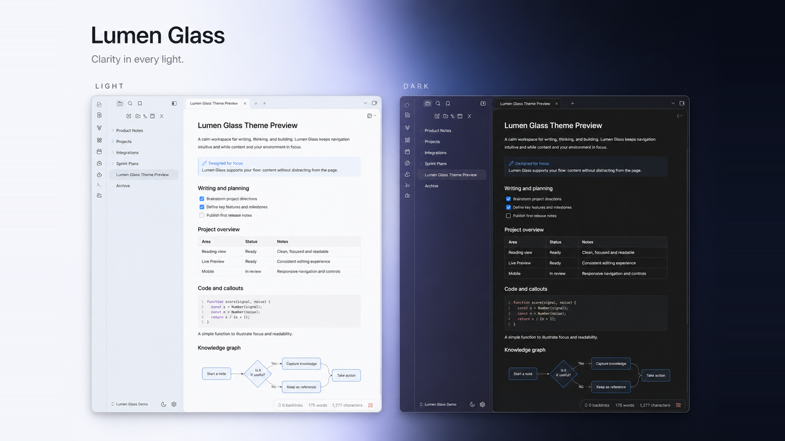

# Lumen Glass

A reading-first light and dark theme for [Obsidian](https://obsidian.md/). Lumen Glass keeps notes on a stable paper surface while using restrained translucency for navigation and controls.



The preview above is a 1280×720 capture of Lumen Glass running in a real Obsidian workspace on macOS. It is not a reconstructed web mockup.

## Features

- Reading-first light and dark appearances with a solid, low-distraction note surface
- Paper neutral by default, with optional colourless Liquid regular and Liquid clear navigation materials
- Translucent sidebars, tabs, status bar, command palette, menus, and mobile navigation without applying glass to note content
- Matched typography and spacing between Live Preview and Reading View
- Refined headings, paragraphs, lists, blockquotes, links, inline code, code blocks, tables, images, callouts, embeds, and Properties
- Support for pop-out windows and responsive mobile layouts
- System-aware fallbacks for reduced transparency, increased contrast, and reduced motion
- Optional customization through the [Style Settings](https://github.com/mgmeyers/obsidian-style-settings) plugin
- Optional Lumen Stage plugin for pan, zoom, and fullscreen diagrams. Any theme can use it; this theme only skins its `.lmm-*` classes
- No remote fonts, images, or other runtime network requests

## Requirements

- Obsidian 1.13.0 or later
- macOS, Windows, Linux, or Obsidian Mobile

> [!IMPORTANT]
> The historical 1.0.0 release predates the Lumen Glass rename and contains the former bilingual manifest name. Do not use it for Lumen Glass; the first supported release is 1.0.1.

## Installation

### Community themes (recommended)

1. Open **Settings → Appearance → Themes**.
2. Select **Manage**, then search for **Lumen Glass**.
3. Select **Install and use**.

Obsidian checks published GitHub releases for updates. Use the theme manager's update action when a new version is available.

### Manual installation

1. Download `manifest.json` and `theme.css` from the [latest release](https://github.com/paddychenc75/obsidian-lumen/releases/latest).
2. Create a folder named `Lumen Glass` inside your vault's `.obsidian/themes/` directory.
3. Copy both files into the new folder.
4. Open **Settings → Appearance → Themes** and select **Lumen Glass**.

### Git

Clone the repository directly into your vault's themes directory:

```bash
git clone https://github.com/paddychenc75/obsidian-lumen.git \
  "/path/to/vault/.obsidian/themes/Lumen Glass"
```

This method tracks the repository rather than packaged releases. Reload Obsidian or switch themes after rebuilding `theme.css`.

## Customization

Install [Style Settings](https://github.com/mgmeyers/obsidian-style-settings) to configure:

- Ambient color bleed intensity
- Paper neutral, Liquid regular, or Liquid clear material character
- Thin, regular, or thick glass density
- Inset or flush workspace layout
- Specular highlight visibility
- Note width and neutral or high-contrast reading surfaces
- Reduced transparency and increased contrast overrides
- Accent color

Lumen Glass also follows the matching accessibility preferences provided by your operating system.

## Development

The build and validation scripts require Node.js 24 or later and have no third-party dependencies.

`theme.css` is a build artifact. Edit the modules in `src/` and rebuild:

```bash
npm run build
npm run check
```

`npm run check` verifies that `theme.css` matches `src/`, so a source edit that was never rebuilt fails rather than shipping silently. It also validates the theme's token graph, radius scale, release metadata, and packaged assets.

Version tags must match the version in `manifest.json`. Pushing a version tag runs the release workflow and uploads the files required by Obsidian. Existing tags and releases remain immutable historical artifacts.

## Contributing

Bug reports and pull requests are welcome. Please run `npm run build` and `npm run check` before submitting a change, and commit the rebuilt `theme.css` along with your source edits.

## License

Lumen Glass is available under the [MIT License](LICENSE).
